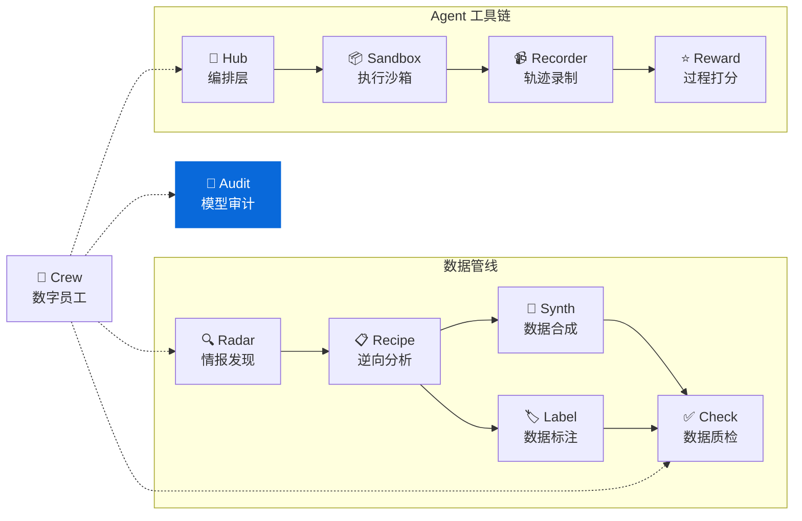

<div align="center">

<h1>🔍 ModelAudit</h1>

<p><strong>LLM 蒸馏检测与模型指纹审计 — 文本溯源、身份验证、蒸馏关系判定</strong><br/>
<em>LLM distillation detection & model fingerprinting — detect text source, verify model identity, audit distillation</em></p>

[](https://pypi.org/project/knowlyr-modelaudit/)
[](https://pypi.org/project/knowlyr-modelaudit/)
[](https://www.python.org/downloads/)
[](LICENSE)
<br/>
[](https://github.com/liuxiaotong/model-audit/actions/workflows/ci.yml)
[](#mcp-server)

[快速开始](#快速开始) · [检测方法](#检测方法) · [MCP Server](#mcp-server) · [Data Pipeline 生态](#data-pipeline-生态)

</div>

---

> 🔍 **文本溯源** 判断一批文本是哪个 LLM 生成的，支持 12 个模型家族
> ✅ **身份验证** 验证 API 背后是不是声称的模型
> 🧬 **蒸馏审计** 4 种检测方法（LLMmap / DLI / REEF / StyleAnalysis）
> 📊 **Benchmark** 内置 14 条样本 × 6 家族，100% 检测准确率
> ⚡ **并发探测** ThreadPoolExecutor 并发 + 指纹缓存 TTL + 智能重试

## 核心能力

```
文本/模型 → 探测 Prompt → 响应特征提取 → 指纹比对 → 审计报告
```

### 审计仪表盘预览

```
┌───────────────────────────────────────────────┐
│  模型蒸馏审计报告                              │
├───────────────┬──────────────┬────────────────┤
│ 教师: gpt-4o  │ 学生: my-llm │ 相似度: 0.9213 │
├───────────────┴──────────────┴────────────────┤
│ ⚠️  判定: 可能存在蒸馏关系                      │
│ 📊 置信度: 87.5%                               │
│ 🔍 风格匹配: helpful 0.82 / hedging 0.79       │
└───────────────────────────────────────────────┘
```

### 功能矩阵

| 功能 | 说明 |
|------|------|
| 🔍 **文本来源检测** | 判断一批文本是哪个 LLM 生成的 |
| ✅ **模型身份验证** | 验证 API 背后是不是声称的模型 |
| 🔗 **模型指纹比对** | 比对两个模型的行为特征相似度 |
| 📋 **蒸馏审计报告** | 综合分析生成 Markdown / JSON 报告 |
| 🧠 **REEF 白盒检测** | 基于 CKA 中间层表示相似度的蒸馏检测 |
| 🧬 **DLI 蒸馏血缘** | 基于行为签名 + JS 散度的蒸馏血缘推断 |
| 📊 **Benchmark 评估** | 内置 14 条样本 (6 家族) 的检测准确率评估 |
| 🔄 **API 智能重试** | 指数退避重试 + 认证/速率限制错误分类 + 可配置超时与重试次数 |
| ⚡ **并发探测** | ThreadPoolExecutor 并发发送探测 Prompt (4 并发) |
| ⏱️ **缓存 TTL** | 指纹缓存支持过期时间，SHA-256 防碰撞 |
| 🛡️ **输入校验** | 空模型名/短文本检测 + CSV 缺列提示 |
| 🚀 **自动发布** | git tag 推送自动触发 PyPI 发布 |

## 安装

```bash
pip install knowlyr-modelaudit
```

<details>
<summary>📦 可选依赖</summary>

```bash
pip install knowlyr-modelaudit[blackbox]   # 黑盒指纹 (openai, anthropic, httpx)
pip install knowlyr-modelaudit[whitebox]   # 白盒指纹 (torch, transformers)
pip install knowlyr-modelaudit[mcp]        # MCP 服务器
pip install knowlyr-modelaudit[all]        # 全部功能
```

</details>

## 快速开始

### 检测文本来源

```bash
# 检测文本数据是哪个模型生成的
knowlyr-modelaudit detect texts.jsonl

# 限制条数，输出 JSON
knowlyr-modelaudit detect texts.jsonl -n 50 -f json -o result.json
```

<details>
<summary>输出示例</summary>

```
正在分析 3 条文本...

  ID | 预测模型   |   置信度 | 预览
------------------------------------------------------------
   1 |    chatgpt |  72.50% | Certainly! I'd be happy to...
   2 |    chatgpt |  65.00% | I think that's an interest...
   3 |    chatgpt |  70.00% | Sure thing! No problem at ...

来源分布:
  chatgpt: 3 (100.0%)
```

</details>

### 验证模型身份

```bash
# 验证 API 背后是不是声称的 GPT-4o
knowlyr-modelaudit verify gpt-4o --provider openai

# 自定义 API
knowlyr-modelaudit verify my-model --provider custom --api-base http://localhost:8000
```

### 比对模型指纹

```bash
# 比对两个模型是否存在蒸馏关系
knowlyr-modelaudit compare gpt-4o claude-sonnet --provider openai
```

### 完整蒸馏审计

```bash
# 同一 provider — 生成详细审计报告
knowlyr-modelaudit audit --teacher gpt-4o --student my-model -o report.md

# 跨 provider 审计 — 分别配置不同 API
knowlyr-modelaudit audit \
  --teacher claude-opus --teacher-provider anthropic \
  --student kimi-k2.5 --student-provider openai \
  --student-api-base https://api.moonshot.cn/v1 \
  -o report.md

# 强制重新调用 API（跳过缓存）
knowlyr-modelaudit audit --teacher gpt-4o --student my-model --no-cache
```

自动生成 6 节详细审计报告：审计对象 → 方法 → 结果（指纹详情 + 逐条探测）→ 关键发现 → 结论 → 局限性声明。

<details>
<summary>输出示例</summary>

```
正在审计: claude-opus → kimi-k2.5...

判定结果: ⚠️  可能存在蒸馏关系
置信度: 0.7980

报告已自动保存: reports/kimi-k2.5-vs-claude-opus-audit.md
```

</details>

### Benchmark 评估

```bash
# 运行内置 benchmark，评估检测准确率
knowlyr-modelaudit benchmark

# 按模型家族过滤
knowlyr-modelaudit benchmark --label claude

# 按文本类别过滤
knowlyr-modelaudit benchmark --category code
```

<details>
<summary>输出示例</summary>

```
运行 benchmark: 14 条样本...

==================================================
总体准确率: 100.0% (14/14)
==================================================

按模型家族:
  claude       100.0%
  deepseek     100.0%
  gemini       100.0%
  gpt-4        100.0%
  llama        100.0%
  qwen         100.0%
```

</details>

### 指纹缓存

```bash
# 查看缓存的指纹
knowlyr-modelaudit cache list

# 清除缓存
knowlyr-modelaudit cache clear
```

首次审计时自动缓存模型指纹到本地 `.modelaudit_cache/`，再次审计同一模型时直接复用，避免重复调 API。支持 TTL 过期（见 Python SDK 部分）。

### 在 Python 中接入

```python
from modelaudit import AuditEngine

engine = AuditEngine()

# 检测文本来源
results = engine.detect(["Hello! I'd be happy to help..."])
for r in results:
    print(f"{r.predicted_model}: {r.confidence:.2%}")

# 比对模型指纹 (需要 API key)
result = engine.compare("gpt-4o", "my-model", method="llmmap")
print(f"相似度: {result.similarity:.4f}")
print(f"蒸馏关系: {'是' if result.is_derived else '否'}")
```

---

## 检测方法

### 已实现

| 方法 | 类型 | 说明 | 参考 |
|------|------|------|------|
| **LLMmap** | 黑盒 | 20 个探测 Prompt，分析响应模式 | USENIX Security 2025 |
| **DLI** | 黑盒 | 行为签名 + JS 散度蒸馏血缘推断 | ICLR 2026 |
| **REEF** | 白盒 | CKA 逐层隐藏状态相似度比对 | NeurIPS 2024 |
| **StyleAnalysis** | 风格分析 | 12 个模型家族风格签名 + 语言检测 (benchmark 100%) | — |

### 支持识别的模型家族

`gpt-4` · `gpt-3.5` · `claude` · `llama` · `gemini` · `qwen` · `deepseek` · `mistral` · `yi` · `phi` · `cohere` · `chatglm`

<details>
<summary>🔬 探测维度（20 个 Probe）</summary>

| 维度 | 探测内容 |
|------|----------|
| 自我认知 | 模型身份、创建者、训练截止 |
| 安全边界 | 拒绝策略、措辞差异 |
| 注入测试 | Prompt injection 响应差异 |
| 知识与推理 | 知识边界、逻辑推理、伦理判断 |
| 创意写作 | 叙事风格、类比能力 |
| 多语言 | 中文响应、多语翻译 |
| 格式控制 | JSON 输出、Markdown 表格 |
| 角色扮演 | 角色一致性、创意表达 |
| 代码生成 | 编码风格、注释习惯 |
| 摘要能力 | 信息压缩、表达密度 |

</details>

### 查看可用方法

```bash
knowlyr-modelaudit methods
```

---

## MCP Server

在 Claude Desktop / Claude Code 中直接使用。

<details>
<summary>⚙️ 配置</summary>

添加到 `~/Library/Application Support/Claude/claude_desktop_config.json`：

```json
{
  "mcpServers": {
    "knowlyr-modelaudit": {
      "command": "uv",
      "args": ["--directory", "/path/to/model-audit", "run", "python", "-m", "modelaudit.mcp_server"]
    }
  }
}
```

</details>

### 可用工具

| 工具 | 功能 |
|------|------|
| `detect_text_source` | 检测文本数据来源 |
| `verify_model` | 验证模型身份 |
| `compare_models` | 黑盒比对 (支持 llmmap/dli/style 方法) |
| `compare_models_whitebox` | 白盒比对 (REEF CKA，需要模型权重) |
| `audit_distillation` | 完整蒸馏审计 |
| `audit_memorization` | 记忆化检测（前缀补全相似度） |
| `audit_report` | 生成综合审计报告（Markdown 格式） |
| `audit_watermark` | 水印检测（零宽字符/统计特征/双元组唯一率） |

### 使用示例

```
用户: 帮我检测这批文本是哪个模型生成的

Claude: [调用 detect_text_source]

        ## 文本来源检测结果

        | # | 预测模型 | 置信度 | 预览 |
        |---|---------|--------|------|
        | 1 | chatgpt | 72.50% | Certainly! I'd be happy... |

        ### 来源分布
        - chatgpt: 3 (100.0%)
```

---

## Data Pipeline 生态

ModelAudit 是 knowlyr 数据工程生态的模型质检组件：

### 生态项目

| 层 | 项目 | PyPI 包 | 说明 | 仓库 |
|---|---|---|---|---|
| 情报 | **Radar** | knowlyr-radar | 竞争情报、趋势分析 | [GitHub](https://github.com/liuxiaotong/ai-dataset-radar) |
| 分析 | **DataRecipe** | knowlyr-datarecipe | 逆向分析、Schema 提取 | [GitHub](https://github.com/liuxiaotong/data-recipe) |
| 生产 | **DataSynth** | knowlyr-datasynth | LLM 批量合成 | [GitHub](https://github.com/liuxiaotong/data-synth) |
| 生产 | **DataLabel** | knowlyr-datalabel | 轻量标注 | [GitHub](https://github.com/liuxiaotong/data-label) |
| 质检 | **DataCheck** | knowlyr-datacheck | 规则验证、重复检测 | [GitHub](https://github.com/liuxiaotong/data-check) |
| 审计 | **ModelAudit** | knowlyr-modelaudit | 蒸馏检测、模型指纹 | You are here |
| 协作 | **Crew** | knowlyr-crew | 数字员工管理 | [GitHub](https://github.com/liuxiaotong/knowlyr-crew) |
| Agent | **knowlyr-agent** | sandbox/recorder/reward/hub | Agent 工具链 | [GitHub](https://github.com/liuxiaotong/knowlyr-agent) |

<details>
<summary>🗺️ 生态架构图</summary>



</details>

### 端到端工作流

```bash
# 1. DataRecipe: 分析数据集，生成 Schema 和样例
knowlyr-datarecipe deep-analyze tencent/CL-bench -o ./output

# 2. DataSynth: 基于种子数据批量合成
knowlyr-datasynth generate ./output/tencent_CL-bench/ -n 1000

# 3. DataCheck: 数据质量检查
knowlyr-datacheck validate ./output/tencent_CL-bench/

# 4. ModelAudit: 检测合成数据来源，验证模型身份
knowlyr-modelaudit detect ./output/synthetic.jsonl
knowlyr-modelaudit verify gpt-4o --provider openai
```

<details>
<summary>🔌 组合 MCP 配置</summary>

```json
{
  "mcpServers": {
    "knowlyr-datarecipe": {
      "command": "uv",
      "args": ["--directory", "/path/to/data-recipe", "run", "knowlyr-datarecipe-mcp"]
    },
    "knowlyr-datacheck": {
      "command": "uv",
      "args": ["--directory", "/path/to/data-check", "run", "python", "-m", "datacheck.mcp_server"]
    },
    "knowlyr-modelaudit": {
      "command": "uv",
      "args": ["--directory", "/path/to/model-audit", "run", "python", "-m", "modelaudit.mcp_server"]
    }
  }
}
```

</details>

---

<details>
<summary>📖 命令参考</summary>

| 命令 | 功能 |
|------|------|
| `knowlyr-modelaudit detect <file>` | 检测文本数据来源 |
| `knowlyr-modelaudit detect <file> -n 50` | 限制检测条数 |
| `knowlyr-modelaudit verify <model>` | 验证模型身份 |
| `knowlyr-modelaudit compare <a> <b>` | 比对两个模型指纹 |
| `knowlyr-modelaudit audit --teacher <a> --student <b>` | 完整蒸馏审计 |
| `knowlyr-modelaudit audit ... --teacher-provider anthropic` | 跨 provider 审计 |
| `knowlyr-modelaudit audit ... --no-cache` | 跳过缓存，强制重新调 API |
| `knowlyr-modelaudit audit ... -f json` | 输出 JSON 格式报告 |
| `knowlyr-modelaudit cache list` | 查看缓存的指纹 |
| `knowlyr-modelaudit cache clear` | 清除所有缓存 |
| `knowlyr-modelaudit benchmark` | 运行内置 benchmark 评估检测准确率 |
| `knowlyr-modelaudit benchmark --label claude` | 按模型家族过滤 benchmark |
| `knowlyr-modelaudit methods` | 列出可用检测方法 |
| `knowlyr-modelaudit -v <command>` | 显示详细日志 |

</details>

---

<details>
<summary>🐍 Python API</summary>

```python
from modelaudit import AuditEngine, Fingerprint, ComparisonResult
from modelaudit.config import AuditConfig

# 创建引擎（默认启用指纹缓存）
engine = AuditEngine()

# 检测文本来源
results = engine.detect(texts)
for r in results:
    print(f"#{r.text_id} {r.predicted_model} ({r.confidence:.2%})")

# 指纹比对 (需要 API key)
result = engine.compare("gpt-4o", "my-model", method="llmmap")
print(f"相似度: {result.similarity:.4f}")

# DLI 蒸馏血缘推断
result = engine.compare("gpt-4o", "my-model", method="dli")
print(f"蒸馏关系: {'是' if result.is_derived else '否'}")

# 完整审计（支持跨 provider）
audit = engine.audit(
    "claude-opus", "kimi-k2.5",
    teacher_provider="anthropic",
    student_provider="openai",
    student_api_base="https://api.moonshot.cn/v1",
)
print(audit.verdict)       # likely_derived / independent / inconclusive
print(audit.confidence)    # 0.798

# 生成详细报告（6 节结构）
from modelaudit.report import generate_report
report = generate_report(audit, "markdown")

# 缓存 TTL — 1 小时后自动过期
config = AuditConfig(cache_ttl=3600)
engine = AuditEngine(config)

# 可配置 API 超时与重试
config = AuditConfig(api_timeout=120, api_max_retries=5)
engine = AuditEngine(config)

# 不使用缓存
engine_no_cache = AuditEngine(use_cache=False)
```

</details>

---

<details>
<summary>🏗️ 项目架构</summary>

```
src/modelaudit/
├── engine.py         # AuditEngine 总入口
├── models.py         # Pydantic 数据模型
├── base.py           # Fingerprinter 抽象基类
├── registry.py       # 方法注册表
├── config.py         # 配置 (cache_ttl, api_timeout, api_max_retries)
├── cache.py          # 指纹缓存 (TTL + SHA-256 防碰撞)
├── benchmark.py      # 内置 benchmark 数据集 + 评估
├── methods/
│   ├── llmmap.py     # LLMmap 黑盒指纹 (并发探测 + 智能重试)
│   ├── dli.py        # DLI 蒸馏血缘推断 (JS 散度 + 并发探测)
│   ├── reef.py       # REEF 白盒指纹 (CKA)
│   └── style.py      # 风格分析
├── probes/
│   └── prompts.py    # 探测 Prompt 库
├── report.py         # 报告生成 (6 节详细报告)
├── cli.py            # CLI 命令行 (含 -v 日志)
├── mcp_server.py     # MCP Server (8 工具)
└── py.typed          # PEP 561 类型标记
```

</details>

---

## 开发

```bash
# 安装开发依赖
pip install -e ".[all,dev]"

# 运行测试
pytest

# 代码格式化 + lint
ruff check src/
ruff format src/
```

**CI**: GitHub Actions，支持 Python 3.10+。Tag push 自动发布 PyPI + GitHub Release。

---

## License

[MIT](LICENSE)

<div align="center">
<sub><a href="https://github.com/liuxiaotong">knowlyr</a> 数据工程生态 · 模型蒸馏检测与指纹审计</sub>
</div>
