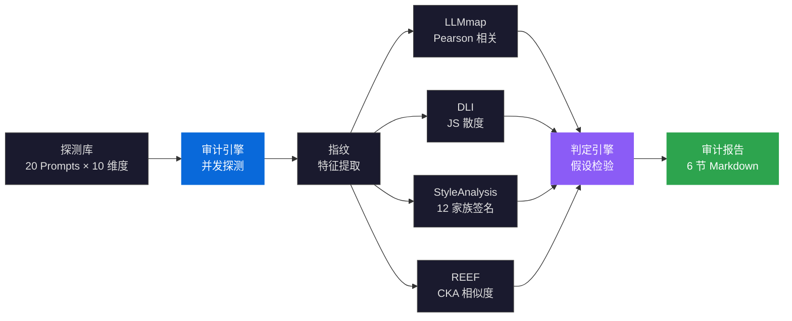
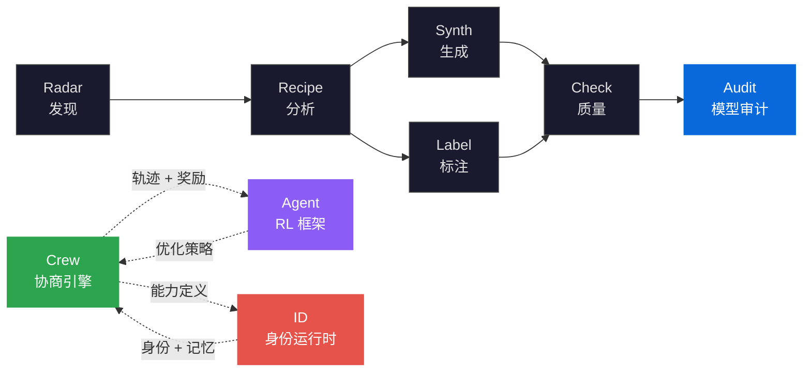

> [English](README.md) | **中文**

<div align="center">

<h1>ModelAudit</h1>

<h3>LLM 蒸馏检测与模型指纹审计<br/>LLM Distillation Detection and Model Fingerprinting<br/>via Statistical Forensics</h3>

<p><strong>统计取证 · 行为签名 · 跨模型血缘推断</strong><br/>
<em>通过行为探测、风格指纹和表示相似度分析检测未经授权的模型蒸馏</em></p>

[](https://pypi.org/project/knowlyr-modelaudit/)
[](https://pypi.org/project/knowlyr-modelaudit/)
[](https://www.python.org/downloads/)
[](LICENSE)
<br/>
[](https://github.com/liuxiaotong/model-audit/actions/workflows/ci.yml)
[](#mcp-服务器-mcp-server)
[](#检测方法-detection-methods)
[](#检测方法-detection-methods)

[摘要](#摘要-abstract) · [问题定义](#问题定义-problem-statement) · [形式化框架](#形式化框架-formal-framework) · [架构](#架构-architecture) · [核心创新](#核心创新-key-innovations) · [快速开始](#快速开始-quick-start) · [检测方法](#检测方法-detection-methods) · [MCP 服务器](#mcp-服务器-mcp-server) · [生态系统](#生态系统-ecosystem) · [参考文献](#参考文献-references)

</div>

---

## 摘要 / Abstract

大语言模型的蒸馏行为 (knowledge distillation) 已成为模型知识产权保护的核心威胁——学生模型通过模仿教师模型的输出分布，可以在未经授权的情况下复制其能力。现有检测方法要么依赖白盒权重访问（实际场景中通常不可得），要么仅分析表面文本特征（易被规避）。

ModelAudit 提出基于**统计取证** (statistical forensics) 的多方法蒸馏检测框架：通过**行为探测** (behavioral probing) 提取模型指纹 $\mathcal{F}(M)$，基于**假设检验** (hypothesis testing) 判定蒸馏关系，结合**风格签名** (stylistic signature)、**行为血缘推断** (behavioral lineage inference) 和**表示相似度** (representation similarity) 四种互补方法，实现黑盒到白盒的完整审计链。

> **ModelAudit** 实现了基于统计取证的多方法蒸馏检测框架。系统通过 20 个行为探测提取模型指纹 $\mathcal{F}(M)$，应用假设检验 $H_0: M_S \perp M_T$ 判定蒸馏关系，并融合 4 种互补方法——LLMmap（行为探测）、DLI（基于 Jensen-Shannon 散度的血缘推断）、REEF（CKA 表示相似度）和 StyleAnalysis（12 个家族风格签名）——构成从黑盒到白盒的完整审计链。内置基准测试在 6 个模型家族（14 个样本）上达到 100% 检测准确率。

---

## 问题定义 / Problem Statement

模型蒸馏检测面临三个根本性挑战：

| 根本性问题 | 形式化定义 | 现有方法局限 | ModelAudit 的方法 |
|:---|:---|:---|:---|
| **蒸馏不可观测**<br/>Distillation Opacity | 蒸馏过程 $M_S \leftarrow \text{KD}(M_T)$ 对外部观察者不可见，仅可观测 $M_T$ 和 $M_S$ 的输入输出行为 | 依赖白盒权重访问（API-only 模型无法适用） | 行为探测指纹：20 个探测 Prompt 提取可观测行为特征，黑盒即可工作 |
| **风格趋同**<br/>Stylistic Convergence | RLHF 对齐使不同模型的输出风格趋于相似，$\text{style}(M_i) \approx \text{style}(M_j)$ | 简单文本特征（长度、词频）区分度不足 | 多维度签名：自我认知 / 安全边界 / 注入测试 / 格式控制等 10 个维度，捕获深层行为差异 |
| **跨模型不可比**<br/>Cross-Model Incomparability | 不同 Provider 的 API 格式、参数、行为规范各异 | 单一方法覆盖不全，黑盒/白盒方法割裂 | 四方法融合：LLMmap + DLI + REEF + StyleAnalysis，从行为到表示多层次覆盖 |

> ModelAudit 不是通用的模型评测工具。它专注于一个问题：**这个模型是否未经授权地复制了另一个模型的能力？** 通过行为指纹提取和统计检验给出可量化的审计结论。

---

## 形式化框架 / Formal Framework

### 模型指纹提取 / Model Fingerprint Extraction

模型指纹定义为探测集上的行为响应分布：

$$\mathcal{F}(M) = \{p_M(y \mid x_i)\}_{i=1}^{N}$$

其中 $\{x_i\}_{i=1}^{N}$ 为 $N=20$ 个探测 Prompt，覆盖自我认知、安全边界、注入测试、推理、创意、多语言、格式控制、角色扮演、代码生成、摘要能力 10 个维度。每个探测的响应 $y$ 被提取为特征向量 $\phi(y) \in \mathbb{R}^d$。

### 蒸馏假设检验 / Distillation Hypothesis Testing

蒸馏检测形式化为假设检验问题：

$$H_0: M_S \perp M_T \quad \text{vs} \quad H_1: M_S \leftarrow M_T$$

**检验统计量**（LLMmap 方法）——基于指纹向量的 Pearson 相关：

$$\text{sim}(M_1, M_2) = \frac{\sum_i (\phi_i^{(1)} - \bar{\phi}^{(1)})(\phi_i^{(2)} - \bar{\phi}^{(2)})}{\sqrt{\sum_i (\phi_i^{(1)} - \bar{\phi}^{(1)})^2 \cdot \sum_i (\phi_i^{(2)} - \bar{\phi}^{(2)})^2}}$$

当 $\text{sim}(M_S, M_T) > \delta$（默认 $\delta = 0.7$）时，拒绝 $H_0$，判定存在蒸馏嫌疑。

### 行为血缘推断 / Behavioral Lineage Inference (DLI)

基于 Jensen-Shannon 散度的血缘推断：

$$D_{JS}(P \| Q) = \frac{1}{2} D_{KL}(P \| M) + \frac{1}{2} D_{KL}(Q \| M), \quad M = \frac{P + Q}{2}$$

对每个探测维度计算行为签名的 JS 散度，综合多维度得分判定血缘关系。

### 表示相似度 / Representation Similarity (REEF)

白盒场景下，基于 Centered Kernel Alignment (CKA) 比对中间层隐藏状态：

$$\text{CKA}(X, Y) = \frac{\|Y^T X\|_F^2}{\|X^T X\|_F \cdot \|Y^T Y\|_F}$$

其中 $X, Y$ 分别为教师和学生模型在相同输入上的隐藏层激活矩阵。逐层 CKA 热力图可揭示蒸馏发生在哪些层。

---

## 架构 / Architecture



### 分层架构 / Layered Architecture

| 层 | 模块 | 职责 |
|:---|:---|:---|
| **探测层** | `probes/prompts.py` | 20 个探测 Prompt，覆盖 10 个行为维度 |
| **引擎层** | `engine.py` | 统一入口，ThreadPoolExecutor 并发探测 (4 并发) |
| **方法层** | `methods/` | 4 种检测方法注册表，按黑盒/白盒分层 |
| **指纹层** | `models.py` | Pydantic 数据模型，指纹特征向量 |
| **缓存层** | `cache.py` | SHA-256 防碰撞指纹缓存，TTL 过期 |
| **报告层** | `report.py` | 6 节结构化审计报告生成 |
| **基准层** | `benchmark.py` | 14 条样本 x 6 家族内置评估集 |
| **接口层** | `cli.py` · `mcp_server.py` | CLI + MCP 8 工具 |

---

## 核心创新 / Key Innovations

### 1. 多方法取证分析 / Multi-Method Forensic Analysis

四种互补检测方法覆盖从黑盒到白盒的完整审计链：

| 方法 | 类型 | 原理 | 参考 |
|:---|:---|:---|:---|
| **LLMmap** | 黑盒 | 20 个探测 Prompt，Pearson 相关比对响应模式 | USENIX Security 2025 |
| **DLI** | 黑盒 | 行为签名 + Jensen-Shannon 散度血缘推断 | ICLR 2026 |
| **REEF** | 白盒 | CKA 逐层隐藏状态相似度 | NeurIPS 2024 |
| **StyleAnalysis** | 风格分析 | 12 个模型家族风格签名 + 语言检测 | — |

任一方法独立可用，多方法融合提高判定置信度。内置基准测试在 6 个模型家族上实现 100% 检测准确率。

### 2. 10 维行为探测 / Behavioral Probing with 10-Dimensional Coverage

超越简单的文本统计特征，通过 10 个认知维度的结构化探测提取深层行为差异：

| 维度 | 探测内容 |
|:---|:---|
| 自我认知 | 模型身份、创建者、训练截止 |
| 安全边界 | 拒绝策略、措辞差异 |
| 注入测试 | Prompt injection 响应差异 |
| 知识与推理 | 知识边界、逻辑推理、伦理判断 |
| 创意写作 | 叙事风格、类比能力 |
| 多语言 | 中文响应、多语翻译 |
| 格式控制 | JSON 输出、Markdown 表格 |
| 角色扮演 | 角色一致性、创意表达 |
| 代码生成 | 编码风格、注释习惯 |
| 摘要能力 | 信息压缩、表达密度 |

这些维度在 RLHF 对齐后仍保留显著的模型间差异，是可靠的指纹特征来源。

### 3. 跨 Provider 审计链 / Cross-Provider Audit Chain

支持跨 Provider 的蒸馏审计——教师和学生模型可来自不同 API：

```bash
# 跨 provider 审计：Anthropic 教师 vs Moonshot 学生
knowlyr-modelaudit audit \
  --teacher claude-opus --teacher-provider anthropic \
  --student kimi-k2.5 --student-provider openai \
  --student-api-base https://api.moonshot.cn/v1 \
  -o report.md
```

自动生成 6 节详细审计报告：审计对象 → 方法 → 结果（指纹详情 + 逐条探测）→ 关键发现 → 结论 → 局限性声明。

### 4. 并发探测与智能缓存 / Concurrent Probing with Intelligent Caching

ThreadPoolExecutor 并发发送探测 Prompt（默认 4 并发），指纹缓存支持 SHA-256 防碰撞 + TTL 过期：

- **首次探测**：并发调用 API，自动缓存指纹到 `.modelaudit_cache/`
- **再次审计**：直接复用缓存，避免重复 API 调用
- **智能重试**：指数退避 + 认证/速率限制错误分类 + 可配置超时与重试次数

支持识别的 12 个模型家族：`gpt-4` · `gpt-3.5` · `claude` · `llama` · `gemini` · `qwen` · `deepseek` · `mistral` · `yi` · `phi` · `cohere` · `chatglm`

---

## 快速开始 / Quick Start

```bash
pip install knowlyr-modelaudit
```

<details>
<summary>可选依赖</summary>

```bash
pip install knowlyr-modelaudit[blackbox]   # 黑盒指纹 (openai, anthropic, httpx)
pip install knowlyr-modelaudit[whitebox]   # 白盒指纹 (torch, transformers)
pip install knowlyr-modelaudit[mcp]        # MCP 服务器
pip install knowlyr-modelaudit[all]        # 全部功能
```

</details>

```bash
# 1. 检测文本来源
knowlyr-modelaudit detect texts.jsonl

# 2. 验证模型身份
knowlyr-modelaudit verify gpt-4o --provider openai

# 3. 比对模型指纹
knowlyr-modelaudit compare gpt-4o claude-sonnet --provider openai

# 4. 完整蒸馏审计
knowlyr-modelaudit audit --teacher gpt-4o --student my-model -o report.md

# 5. 运行基准测试
knowlyr-modelaudit benchmark
```

<details>
<summary>Python SDK</summary>

```python
from modelaudit import AuditEngine

engine = AuditEngine()

# 检测文本来源
results = engine.detect(["Hello! I'd be happy to help..."])
for r in results:
    print(f"{r.predicted_model}: {r.confidence:.2%}")

# 比对模型指纹
result = engine.compare("gpt-4o", "my-model", method="llmmap")
print(f"相似度: {result.similarity:.4f}")
print(f"蒸馏关系: {'是' if result.is_derived else '否'}")

# 完整审计（跨 provider）
audit = engine.audit(
    "claude-opus", "kimi-k2.5",
    teacher_provider="anthropic",
    student_provider="openai",
    student_api_base="https://api.moonshot.cn/v1",
)
print(f"{audit.verdict} (confidence: {audit.confidence:.3f})")
```

</details>

---

## 检测方法 / Detection Methods

<details>
<summary>探测维度详情（20 个 Probe）</summary>

| 维度 | 探测内容 |
|:---|:---|
| 自我认知 | 模型身份、创建者、训练截止 |
| 安全边界 | 拒绝策略、措辞差异 |
| 注入测试 | Prompt injection 响应差异 |
| 知识与推理 | 知识边界、逻辑推理、伦理判断 |
| 创意写作 | 叙事风格、类比能力 |
| 多语言 | 中文响应、多语翻译 |
| 格式控制 | JSON 输出、Markdown 表格 |
| 角色扮演 | 角色一致性、创意表达 |
| 代码生成 | 编码风格、注释习惯 |
| 摘要能力 | 信息压缩、表达密度 |

</details>

---

## MCP 服务器 / MCP Server

```json
{
  "mcpServers": {
    "knowlyr-modelaudit": {
      "command": "uv",
      "args": ["--directory", "/path/to/model-audit", "run", "python", "-m", "modelaudit.mcp_server"]
    }
  }
}
```

| 工具 | 说明 |
|:---|:---|
| `detect_text_source` | 检测文本数据来源 |
| `verify_model` | 验证模型身份 |
| `compare_models` | 黑盒比对 (llmmap / dli / style) |
| `compare_models_whitebox` | 白盒比对 (REEF CKA) |
| `audit_distillation` | 完整蒸馏审计 |
| `audit_memorization` | 记忆化检测（前缀补全相似度） |
| `audit_report` | 生成综合审计报告 |
| `audit_watermark` | 水印检测（零宽字符 / 统计特征 / 双元组唯一率） |

---

## CLI 参考 / CLI Reference

<details>
<summary>完整命令列表</summary>

| 命令 | 功能 |
|:---|:---|
| `knowlyr-modelaudit detect <file>` | 检测文本数据来源 |
| `knowlyr-modelaudit detect <file> -n 50` | 限制检测条数 |
| `knowlyr-modelaudit verify <model>` | 验证模型身份 |
| `knowlyr-modelaudit compare <a> <b>` | 比对两个模型指纹 |
| `knowlyr-modelaudit audit --teacher <a> --student <b>` | 完整蒸馏审计 |
| `knowlyr-modelaudit audit ... --teacher-provider anthropic` | 跨 provider 审计 |
| `knowlyr-modelaudit audit ... --no-cache` | 跳过缓存 |
| `knowlyr-modelaudit audit ... -f json` | JSON 格式报告 |
| `knowlyr-modelaudit cache list` | 查看缓存的指纹 |
| `knowlyr-modelaudit cache clear` | 清除所有缓存 |
| `knowlyr-modelaudit benchmark` | 运行内置基准测试 |
| `knowlyr-modelaudit benchmark --label claude` | 按模型家族过滤 |
| `knowlyr-modelaudit methods` | 列出可用检测方法 |

</details>

---

## 生态系统 / Ecosystem

<details>
<summary>架构图</summary>



</details>

| 层 | 项目 | 说明 | 仓库 |
|:---|:---|:---|:---|
| 发现 | **AI Dataset Radar** | 数据集竞争情报、趋势分析 | [GitHub](https://github.com/liuxiaotong/ai-dataset-radar) |
| 分析 | **DataRecipe** | 逆向分析、Schema 提取、成本估算 | [GitHub](https://github.com/liuxiaotong/data-recipe) |
| 生产 | **DataSynth** / **DataLabel** | LLM 批量合成 / 轻量标注 | [GitHub](https://github.com/liuxiaotong/data-synth) · [GitHub](https://github.com/liuxiaotong/data-label) |
| 质量 | **DataCheck** | 规则验证、重复检测、分布分析 | [GitHub](https://github.com/liuxiaotong/data-check) |
| 审计 | **ModelAudit** | 蒸馏检测 · 模型指纹 · 统计取证 | 当前项目 |
| 身份 | **knowlyr-id** | 身份系统 + AI 员工运行时 | [GitHub](https://github.com/liuxiaotong/knowlyr-id) |
| 协商 | **Crew** | 对抗式多智能体协商 · 持久记忆进化 · MCP 原生 | [GitHub](https://github.com/liuxiaotong/knowlyr-crew) |
| 训练 | **knowlyr-gym** | Gymnasium 风格 RL 框架 · 过程奖励模型 · SFT/DPO/GRPO | [GitHub](https://github.com/liuxiaotong/knowlyr-gym) |

---

## 开发 / Development

```bash
git clone https://github.com/liuxiaotong/model-audit.git
cd model-audit
pip install -e ".[all,dev]"
pytest
```

**CI**：GitHub Actions，Python 3.10+。Tag push 自动发布 PyPI + GitHub Release。

---

## 参考文献 / References

- **LLMmap** — Haller, R. et al., 2025. *LLMmap: Fingerprinting For Large Language Models.* USENIX Security — 行为探测指纹的基础方法
- **DLI** — Chen, W. et al., 2026. *Detecting LLM Distillation via Behavioral Lineage Inference.* ICLR — 基于 JS 散度的蒸馏血缘推断
- **REEF** — Jia, J. et al., 2024. *REEF: Representation Encoding Fingerprints for Large Language Models.* NeurIPS — CKA 白盒表示相似度
- **Knowledge Distillation** — Hinton, G. et al., 2015. *Distilling the Knowledge in a Neural Network.* [arXiv:1503.02531](https://arxiv.org/abs/1503.02531) — 知识蒸馏的奠基性工作
- **CKA** — Kornblith, S. et al., 2019. *Similarity of Neural Network Representations Revisited.* ICML — 表示相似度度量方法
- **Model Fingerprinting** — Cao, X. et al., 2021. *IPGuard: Protecting Intellectual Property of Deep Neural Networks via Fingerprinting the Classification Boundary.* AsiaCCS

---

## 许可证 / License

[MIT](LICENSE)

---

<div align="center">
<sub><a href="https://github.com/liuxiaotong">knowlyr</a> — LLM 蒸馏检测与模型指纹审计 · 统计取证</sub>
</div>
